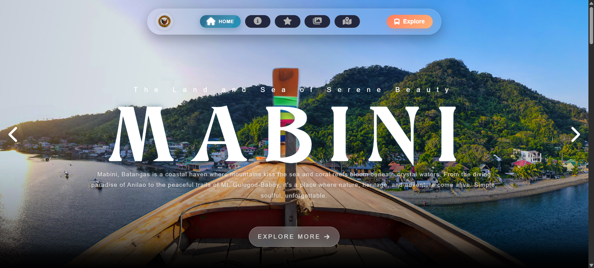
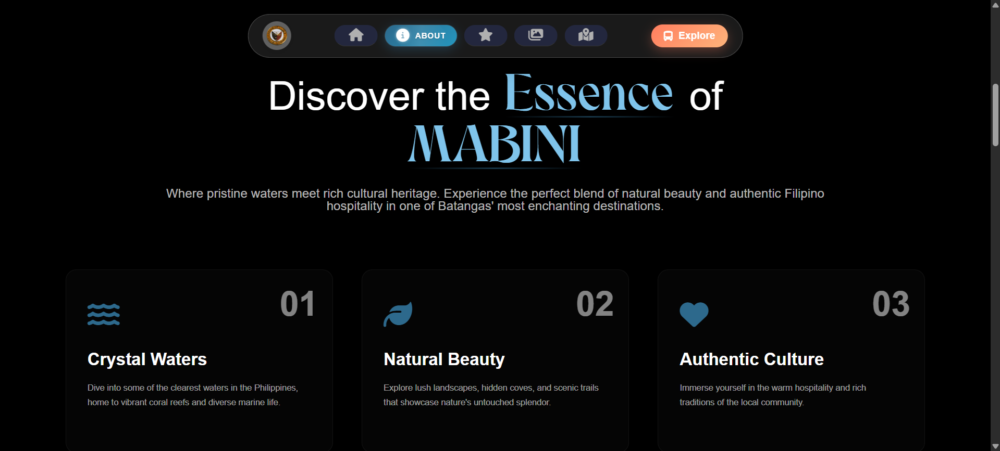
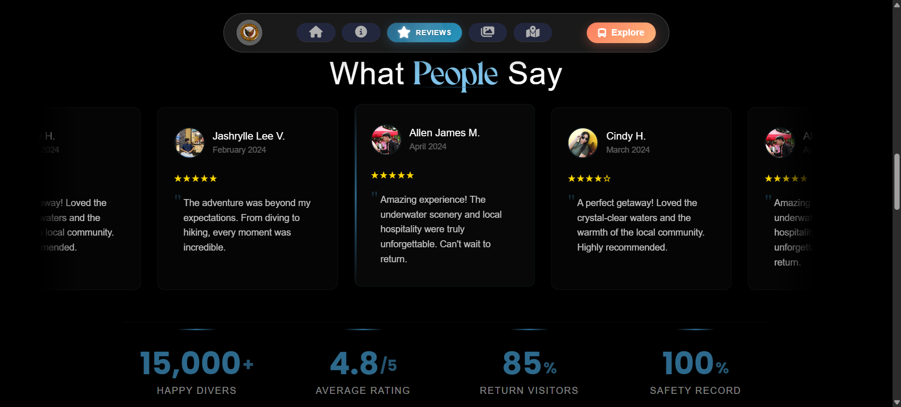
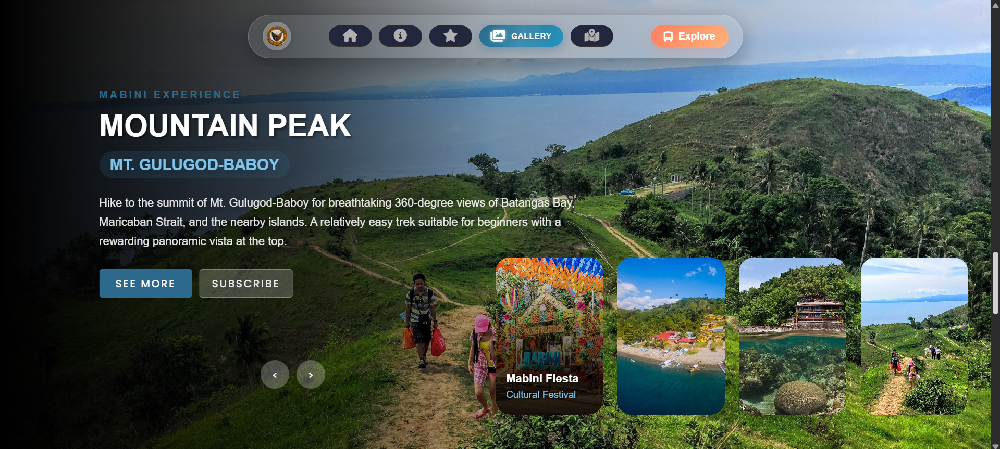
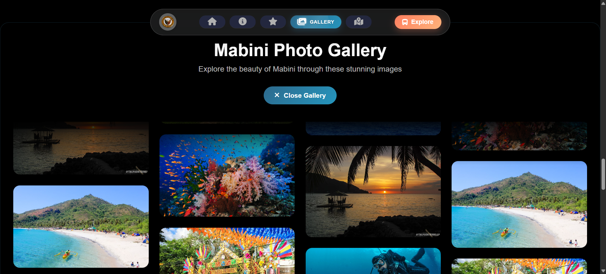

# Mabini Tourism Webpage

# Mabini Tourism Website

A responsive tourism website showcasing the beautiful municipality of Mabini, Batangas, Philippines.

## Overview
This website is designed to promote tourism in Mabini, Batangas, featuring its stunning coastal attractions, diving spots, hiking trails, and rich cultural heritage. The site provides an immersive experience for travelers looking to explore this destination known as the "Land and Sea of Serene Beauty."

## Features
- **Hero Section** - Dynamic background slider with interactive navigation controls
- **About Section** - Expandable cards showcasing Mabini's natural beauty and culture (mobile-friendly)
- **Gallery Section** - Interactive image carousel with thumbnail navigation and masonry gallery
- **Reviews Section** - Animated marquee display of traveler testimonials with star ratings
- **Statistics Section** - Count-up animations for visitor statistics
- **Contact Section** - Interactive Google Maps with toggle functionality
- **Responsive Design** - Mobile-first approach with hamburger menu for mobile devices
- **Smooth Navigation** - Fixed navigation bar with active link highlighting

## Technologies Used
- **HTML5** - Semantic markup structure
- **CSS3** - Advanced animations, flexbox, grid, and responsive design
- **JavaScript (ES6+)** - Interactive functionality and dynamic content
- **Font Awesome** - Icon library for UI elements
- **Google Fonts** - Poppins and Inter font families
- **Custom Font** - round_8four for stylized headings

